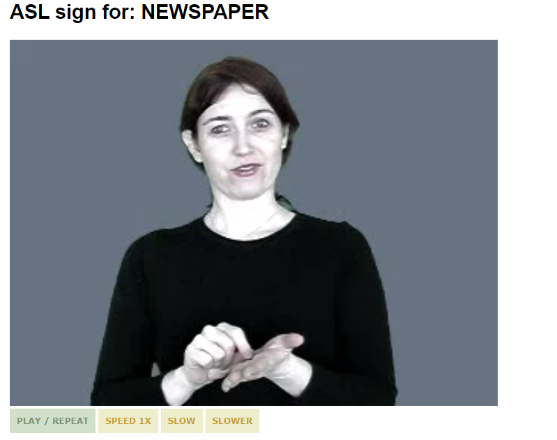
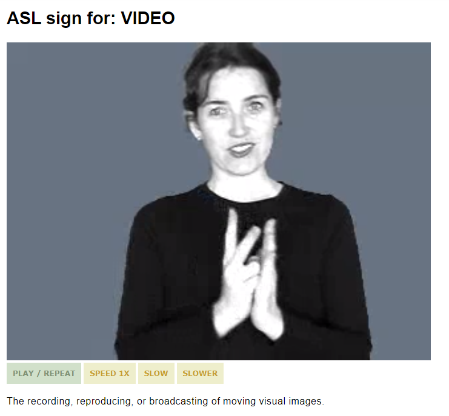
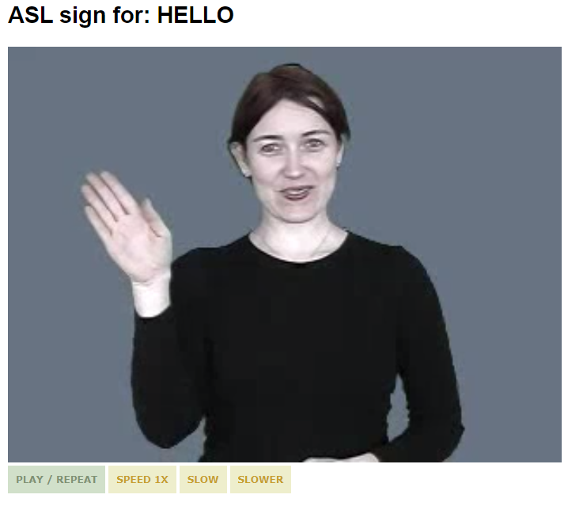
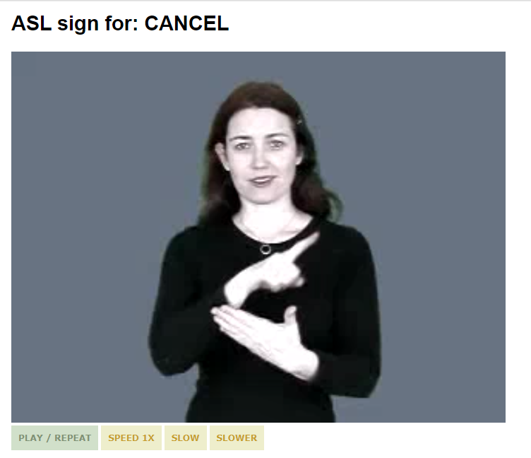
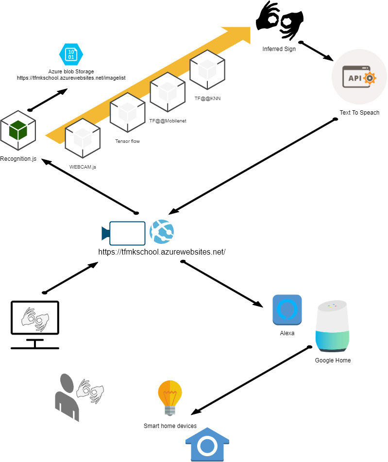
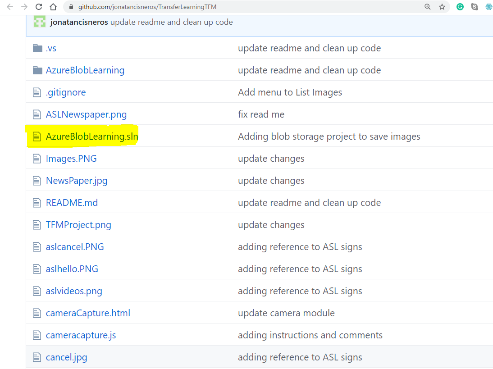
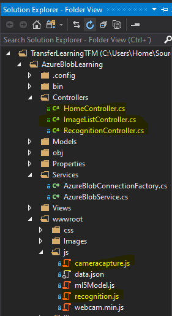
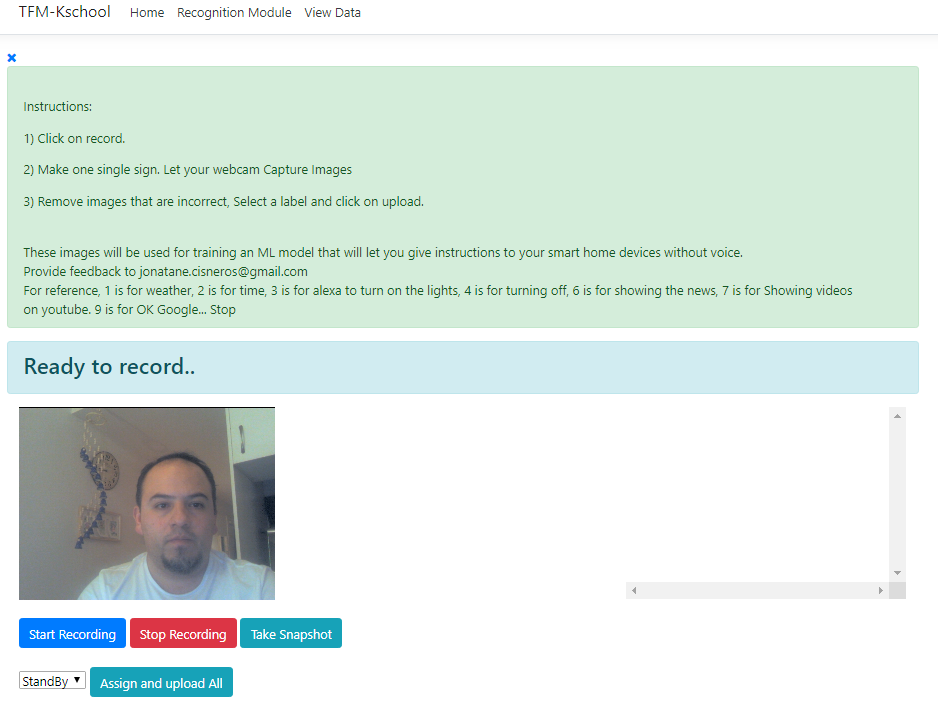

# Enabling Hard-of-hearing people to use smart home devices 
## Master's in Data Science thesis  

The original presentation about this project is located [Here](https://docs.google.com/presentation/d/1U8Fh9lIXX2PHpe9coVYaAeiIzGRLxv1RUURDaEwLVNk/edit?usp=sharing)


## Contents
[What is the Hard-of-hearing smart home assistant?](#What-is-this-project-about?) <br>
[Why is it relevant?](#why-is-it-relevant?) <br>
[How do I install the project?](#how-do-i-install-the-project) <br>
[How do I use the application?](#how-do-i-use-the-application) <br>
[How does it work?](#how-does-it-work?) <br>
[Data](#data) <br>
[Project structure](#project-structure) <br>
[Model breakdown](#model-breakdown) <br>
[Performance](#performance) <br>
[Limitations](#limitations)
 


## What is this project about?

The Hard-of-hearing assistant is an application capable of recognizing simple 
[sign language](https://www.handspeak.com/word/search/index.php?id=1487) commands so it can translate them into voice assistant instructions and also present other useful information on the screen like the weather and time.

This app can run on any device with a camera and a screen and the examples shown are integrating two of the most important smart home devices, [Alexa](https://developer.amazon.com/en-US/alexa) and [Google Home](https://store.google.com/product/google_home) .

This project was born from my interest in making AI projects for good by always being inclusive. 

I also realized a use case where people that don't want to share their conversations can also benefit from this tool as their voice wouldn't be recorded considering that this tool can run completely offline.

Below are some examples that were used for this project. As a reference, I have used a dictionary of Sign language.


| Training      | Reference |
| ------------- |:-------------:| 
|     | | 
|     | | 
|     | | 
|     | | 
 
 
### Technologies used.

There are technologies like Azure blob storage that I chose because of the ability to acquire free credits as a student together with my prior experience in using them.

1. Azure blob Storage
I have used blob storage to upload all the images used for several runs.

2. MVC Web APIs
I have used WEB APIs to store and retrieve the images. 

3. Tensorflow.js
For implementing two models, the one from mobilenet and also KNN.

4. Text to speech API
To speak commands to the smart home devices, the result of the inference is parsed and converted into speech.




## Why is it relevant?

Many of the smart home devices that are now being sold only work with [Google Home and Alexa](https://www.digitaltrends.com/home/best-google-home-compatible-devices). This is leaving many people out of the possibility of using these excellent devices, for example, the elderly, kids with autism as well as other people with hard of hearing problems.

It becomes relevant for everyone else as it enables people not wanting to speak out loud the same commands all the time to use their devices differently.

Another benefit of this tool could be the possibility of making Sign language more universal, at least for some important keywords.


## How do I Install the project?

If you wish to run the project in development mode I suggest you download Visual Studio Community edition and run the solution file which is a .NET project:

Once you have cloned this repository, open the solution file:




The project consists of two parts, both are included in the same Visual studio .NET project.  

1. A labeling tool built for the whole purpose of collecting and labeling the signs that I wanted to use for this project.

This labeling tool is already deployed to [azure](http://tfmkschool.azurewebsites.net).

In the image below, the labelling tool is associated to the Home Controller.




2. A recognition module which is the one that infers images from your webcam and it is also deployed into azure [here](https://tfmkschool.azurewebsites.net/recognition).

The recognition module is associated to the recognition controller.


3. Finally, a third controller is intended to serve the list of images.


## How do I use the application?


The following [video](https://www.youtube.com/watch?v=sKn2nvj3qBE&feature=youtu.be) shows the live application and sample commands. 

<a href="http://www.youtube.com/watch?feature=player_embedded&v=sKn2nvj3qBE
" target="_blank"></a>

## How does it work?

The project uses [transfer learning](https://en.wikipedia.org/wiki/Transfer_learning), a technique that leverages the knowledge acquired from an existing model and then uses this knowledge for a different purpose.  

In this case, the model is **mobilenet** which was trained on millions of images and its output activation help simplifying an input image into a vector that can be easily used in another model.


 
## Data
The data has been collected using the labeling tool developed specifically for this project. Each session has been tested with about a thousand images. Results vary depending on the number of samples uploaded per each class.

The data being used for the recognition website can be accessed in this [link](https://tfmkschool.azurewebsites.net/ImageList).

Below you can see a screenshot of the data collection app.



Data is stored in Azure blob storage.  It is also available to be consumed as an API to be used for reporting:

```
https://tfmkschool.azurewebsites.net/ImageList/Data
```


## Project structure
The project was built in .NET MVC and has two modules:

 - **Labelling module**: 
 
 - **Recognition module**: 
 
The recognition module is mainly based on the following Javascript [file](https://tfmkschool.azurewebsites.net/js/recognition.js
)

```
**https://tfmkschool.azurewebsites.net/js/recognition.js**


```


## Here are the major steps performed by the recognition model.


1. Download all the images from the blob container using a call similar to: 

https://tfmkschool.azurewebsites.net/imagelist/Data


2. Loop through all the images loaded from the API and add them to the mobile net model to obtain its activation and pass them to the KNN classifier.

```
    const addExample = classId => {
        
         
        // Obtain activation from mobilenet
        const activation = net.infer(webcamElement, 'conv_preds');

        // Pass the intermediate activation to the KNN classifier.
        classifier.addExample(activation, classId);

 
    };

```

3. Once the Classifier has included all images, start inferencing from the webcam.
```
     if (classifier.getNumClasses() > 0 && state != "Training model") {

            // Get the activation from mobilenet from the webcam.
            const activation = net.infer(webcamElement, 'conv_preds');
            // Get the most likely class and confidences from the classifier module.

            let result = await classifier.predictClass(activation);

            

            if (result.label != null) {


                //Show results
                 document.getElementById('console').innerText = `
                  prediction ID: ${result.label}\n
                  prediction: ${classes[result.label]}\n
                  probability: ${result.confidences[result.label]}\n
                  clases: ${JSON.stringify(classes)}\n
                  confidences: ${JSON.stringify(result.confidences)}
                `;
        

```


4. Invoke text to speech when needed.

```
  responsiveVoice.speak("Ok Google, stop");
```


 The recognition module is using Text to speech so it can talk to the smart home devices. The following library was used for this purpose.
 
 https://code.responsivevoice.org
 
 
## Model breakdown

The tensor flow library allows us to implement tensor flow models in any browser.

```
<script type="text/javascript" src="https://unpkg.com/@@tensorflow/tfjs"></script>
```

**The following models are loaded at runtime**

Mobilenet:

As discussed previously, mobilenet is a neural network trained with millions of images and this specific model allows us to capture an activation before the actual result.

```
<script type="text/javascript" src="https://unpkg.com/@@tensorflow-models/mobilenet"></script>
```

The KNN classifier model allows us to implement a KNN model that will be described in detail.

```
<script type="text/javascript" src="https://unpkg.com/@@tensorflow-models/knn-classifier"></script>
```


## Limitations

I realized that the recorded images used for KNN have to be limited for the model to work properly in a browser, otherwise it can slow down the client device.

## Conclusions

I believe this is a project that can serve many people and at the same time, I know it is possible to find ways to improve its performance, for example, By using multiple models and loading them depending on the initial command, it would be possible to create a graph of models that in themselves are simple to train, but it becomes powerful when combined with some lines of code.